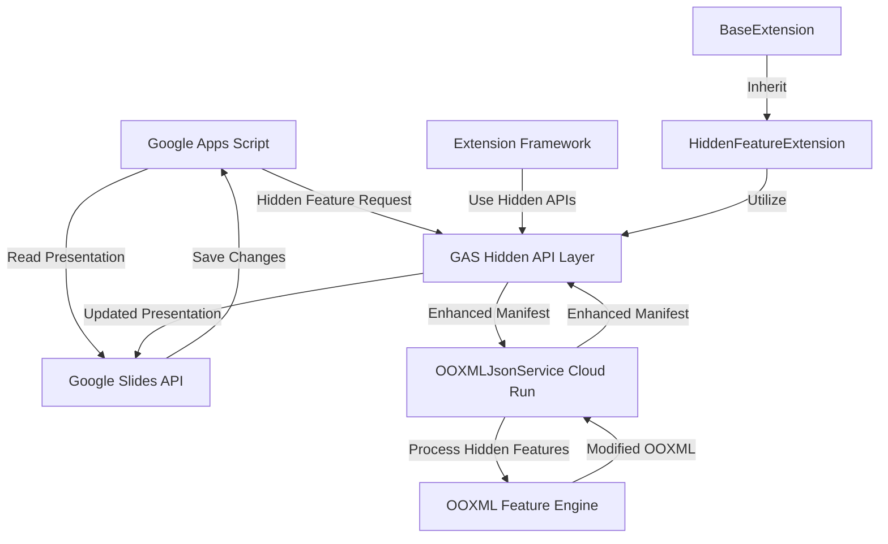

# GAS Hidden Features API via Cloud Run Bridge - Technical Specifications

## Architecture Overview

The technical implementation extends the existing OOXMLJsonService Cloud Run architecture to expose hidden OOXML features through enhanced JSON manifests and specialized processing endpoints, while maintaining the proven GAS → Cloud Run → GAS pattern.



## Cloud Run Service Extensions

### 1. Enhanced OOXMLJsonService Architecture

#### 1.1 Service Structure Extension
```javascript
// Extend existing index.mjs with hidden feature modules
import { HiddenFeatureProcessor } from './features/processor.mjs';
import { DrawMLEngine } from './features/drawml.mjs';
import { TypographyEngine } from './features/typography.mjs';
import { ThemeEngine } from './features/theme.mjs';
import { TableEngine } from './features/tables.mjs';

// Add to existing app
const hiddenFeatureProcessor = new HiddenFeatureProcessor({
  drawml: new DrawMLEngine(),
  typography: new TypographyEngine(),
  theme: new ThemeEngine(),
  tables: new TableEngine()
});
```

#### 1.2 Hidden Feature Detection Endpoint
```javascript
// GET /features/detect
app.get("/features/detect", async (req, res) => {
  try {
    const capabilities = {
      version: "1.1.0",
      features: {
        drawml: {
          available: true,
          operations: ["customGeometry", "3dEffects", "complexPaths"],
          limits: { maxVertices: 10000, maxEffects: 50 }
        },
        typography: {
          available: true,
          operations: ["fontVariants", "advancedSpacing", "textEffects"],
          limits: { maxTextRuns: 1000, maxEffectsPerRun: 20 }
        },
        theme: {
          available: true,
          operations: ["advancedPalettes", "fontHierarchies", "effectStyles"],
          limits: { maxColors: 256, maxFonts: 50 }
        },
        tables: {
          available: true,
          operations: ["customStyles", "complexBorders", "conditionalMerge"],
          limits: { maxRows: 500, maxCols: 50 }
        }
      },
      compatibility: {
        googleSlides: "preserved",
        powerpoint: "enhanced",
        roundtrip: "guaranteed"
      }
    };
    
    res.json(capabilities);
  } catch (error) {
    res.status(500).json({ error: error.message });
  }
});
```

#### 1.3 Enhanced Manifest Processing
```javascript
// POST /unwrap - Extended to include hidden feature annotations
app.post("/unwrap", async (req, res) => {
  try {
    const { zipB64, gcsIn, includeHiddenFeatures = false } = req.body || {};
    
    // Existing unwrap logic...
    const manifest = await unwrapToManifest(inputBuffer);
    
    if (includeHiddenFeatures) {
      // Annotate manifest with hidden feature opportunities
      manifest.hiddenFeatures = await hiddenFeatureProcessor.detectOpportunities(manifest);
      
      // Add feature metadata
      manifest.features = {
        drawml: await hiddenFeatureProcessor.drawml.analyze(manifest),
        typography: await hiddenFeatureProcessor.typography.analyze(manifest),
        theme: await hiddenFeatureProcessor.theme.analyze(manifest),
        tables: await hiddenFeatureProcessor.tables.analyze(manifest)
      };
    }
    
    res.json(manifest);
  } catch (error) {
    res.status(500).json({ error: error.message });
  }
});
```

#### 1.4 Hidden Feature Processing Endpoint
```javascript
// POST /features/process
app.post("/features/process", async (req, res) => {
  try {
    const { manifest, operations, preserveCompatibility = true } = req.body || {};
    
    if (!manifest || !Array.isArray(operations)) {
      return res.status(400).json({ error: "manifest and operations[] required" });
    }
    
    // Process each operation through the appropriate engine
    const results = [];
    const processedManifest = JSON.parse(JSON.stringify(manifest)); // Deep clone
    
    for (const op of operations) {
      try {
        let result;
        switch (op.featureType) {
          case 'drawml':
            result = await hiddenFeatureProcessor.drawml.process(processedManifest, op);
            break;
          case 'typography':
            result = await hiddenFeatureProcessor.typography.process(processedManifest, op);
            break;
          case 'theme':
            result = await hiddenFeatureProcessor.theme.process(processedManifest, op);
            break;
          case 'tables':
            result = await hiddenFeatureProcessor.tables.process(processedManifest, op);
            break;
          default:
            throw new Error(`Unknown feature type: ${op.featureType}`);
        }
        
        results.push({
          operation: op,
          success: true,
          result: result,
          compatibilityImpact: result.compatibilityImpact || 'none'
        });
        
      } catch (error) {
        results.push({
          operation: op,
          success: false,
          error: error.message,
          compatibilityImpact: 'unknown'
        });
      }
    }
    
    // Validate compatibility if required
    if (preserveCompatibility) {
      const compatibilityReport = await validateGoogleSlidesCompatibility(processedManifest);
      if (compatibilityReport.violations.length > 0) {
        return res.status(400).json({
          error: "Compatibility violations detected",
          violations: compatibilityReport.violations,
          results: results
        });
      }
    }
    
    res.json({
      manifest: processedManifest,
      operations: results,
      compatibility: preserveCompatibility ? 'verified' : 'unchecked',
      performance: {
        operationsCount: operations.length,
        successCount: results.filter(r => r.success).length,
        processingTime: Date.now() - startTime
      }
    });
    
  } catch (error) {
    res.status(500).json({ error: error.message });
  }
});
```

### 2. Hidden Feature Engines

#### 2.1 DrawML Engine
```javascript
// features/drawml.mjs
export class DrawMLEngine {
  constructor() {
    this.operations = new Map([
      ['customGeometry', this.processCustomGeometry.bind(this)],
      ['3dEffects', this.process3DEffects.bind(this)],
      ['complexPaths', this.processComplexPaths.bind(this)]
    ]);
  }
  
  async analyze(manifest) {
    const shapes = this.findShapesInManifest(manifest);
    const opportunities = {
      customGeometryPossible: shapes.filter(s => this.canEnhanceGeometry(s)),
      threeDEffectsPossible: shapes.filter(s => this.canAdd3DEffects(s)),
      complexPathsPossible: shapes.filter(s => this.canAddComplexPaths(s))
    };
    
    return {
      totalShapes: shapes.length,
      enhanceable: Object.values(opportunities).flat().length,
      opportunities
    };
  }
  
  async process(manifest, operation) {
    const processor = this.operations.get(operation.type);
    if (!processor) {
      throw new Error(`DrawML operation not supported: ${operation.type}`);
    }
    
    return await processor(manifest, operation.parameters);
  }
  
  async processCustomGeometry(manifest, params) {
    const { shapeId, geometry, styling = {} } = params;
    
    // Find the shape in the manifest
    const shapeEntry = this.findShapeEntry(manifest, shapeId);
    if (!shapeEntry) {
      throw new Error(`Shape not found: ${shapeId}`);
    }
    
    // Parse existing XML
    const shapeXml = this.parseShapeXML(shapeEntry.text);
    
    // Create custom geometry XML
    const customGeometry = this.createCustomGeometryXML(geometry, styling);
    
    // Merge with existing shape
    const enhancedXML = this.mergeGeometryIntoShape(shapeXml, customGeometry);
    
    // Update manifest
    shapeEntry.text = this.serializeShapeXML(enhancedXML);
    shapeEntry.hiddenFeatures = shapeEntry.hiddenFeatures || [];
    shapeEntry.hiddenFeatures.push({
      type: 'customGeometry',
      applied: new Date().toISOString(),
      parameters: params,
      compatibilityImpact: 'visual-enhancement'
    });
    
    return {
      shapeId,
      geometryApplied: true,
      vertexCount: geometry.vertices?.length || 0,
      compatibilityImpact: 'visual-enhancement'
    };
  }
  
  createCustomGeometryXML(geometry, styling) {
    // Generate OOXML for custom geometry
    const { vertices, paths, curves = [] } = geometry;
    
    let xml = `<a:custGeom>`;
    xml += `<a:avLst/>`; // Adjustment values list
    xml += `<a:gdLst/>`; // Guide list
    xml += `<a:ahLst/>`; // Adjustment handle list
    xml += `<a:cxnLst/>`; // Connection list
    xml += `<a:rect l="0" t="0" r="21600" b="21600"/>`;
    xml += `<a:pathLst>`;
    xml += `<a:path w="21600" h="21600">`;
    
    // Process vertices and paths
    for (let i = 0; i < vertices.length; i++) {
      const vertex = vertices[i];
      if (i === 0) {
        xml += `<a:moveTo><a:pt x="${vertex.x}" y="${vertex.y}"/></a:moveTo>`;
      } else {
        xml += `<a:lnTo><a:pt x="${vertex.x}" y="${vertex.y}"/></a:lnTo>`;
      }
    }
    
    // Add curves if specified
    for (const curve of curves) {
      xml += `<a:quadBezTo>`;
      xml += `<a:pt x="${curve.controlX}" y="${curve.controlY}"/>`;
      xml += `<a:pt x="${curve.endX}" y="${curve.endY}"/>`;
      xml += `</a:quadBezTo>`;
    }
    
    if (geometry.closed !== false) {
      xml += `<a:close/>`;
    }
    
    xml += `</a:path>`;
    xml += `</a:pathLst>`;
    xml += `</a:custGeom>`;
    
    return xml;
  }
  
  // Additional DrawML methods...
}
```

#### 2.2 Typography Engine
```javascript
// features/typography.mjs
export class TypographyEngine {
  constructor() {
    this.operations = new Map([
      ['fontVariants', this.processFontVariants.bind(this)],
      ['advancedSpacing', this.processAdvancedSpacing.bind(this)],
      ['textEffects', this.processTextEffects.bind(this)]
    ]);
    
    // Font variant mappings
    this.fontVariants = {
      'thin': { weight: 100, style: 'normal' },
      'light': { weight: 300, style: 'normal' },
      'regular': { weight: 400, style: 'normal' },
      'medium': { weight: 500, style: 'normal' },
      'semibold': { weight: 600, style: 'normal' },
      'bold': { weight: 700, style: 'normal' },
      'extrabold': { weight: 800, style: 'normal' },
      'black': { weight: 900, style: 'normal' }
    };
  }
  
  async analyze(manifest) {
    const textElements = this.findTextElementsInManifest(manifest);
    const opportunities = {
      fontVariantsAvailable: textElements.filter(t => this.canApplyFontVariants(t)),
      spacingEnhanceable: textElements.filter(t => this.canImproveSpacing(t)),
      effectsApplicable: textElements.filter(t => this.canAddTextEffects(t))
    };
    
    return {
      totalTextElements: textElements.length,
      enhanceable: Object.values(opportunities).flat().length,
      opportunities,
      fontFamiliesFound: this.extractFontFamilies(textElements)
    };
  }
  
  async processFontVariants(manifest, params) {
    const { textId, fontFamily, variant, fallbacks = [] } = params;
    
    const textEntry = this.findTextEntry(manifest, textId);
    if (!textEntry) {
      throw new Error(`Text element not found: ${textId}`);
    }
    
    const variantConfig = this.fontVariants[variant];
    if (!variantConfig) {
      throw new Error(`Font variant not supported: ${variant}`);
    }
    
    // Parse text XML
    const textXml = this.parseTextXML(textEntry.text);
    
    // Apply font variant
    const enhancedXML = this.applyFontVariantToXML(textXml, {
      fontFamily,
      ...variantConfig,
      fallbacks
    });
    
    // Update manifest
    textEntry.text = this.serializeTextXML(enhancedXML);
    textEntry.hiddenFeatures = textEntry.hiddenFeatures || [];
    textEntry.hiddenFeatures.push({
      type: 'fontVariant',
      applied: new Date().toISOString(),
      parameters: params,
      compatibilityImpact: 'graceful-degradation'
    });
    
    return {
      textId,
      variantApplied: variant,
      fontFamily,
      compatibilityImpact: 'graceful-degradation'
    };
  }
  
  applyFontVariantToXML(textXml, fontConfig) {
    // Generate OOXML for advanced font configuration
    const runProperties = `
      <a:rPr>
        <a:latin typeface="${fontConfig.fontFamily}" 
               pitchFamily="18" 
               charset="0"/>
        <a:cs typeface="${fontConfig.fontFamily}" 
              pitchFamily="18" 
              charset="0"/>
        ${fontConfig.weight !== 400 ? `<a:b val="1"/>` : ''}
        ${fontConfig.style === 'italic' ? `<a:i val="1"/>` : ''}
        <a:theme-font-ref val="${this.mapToThemeFont(fontConfig.fontFamily)}"/>
      </a:rPr>
    `;
    
    return this.mergeRunPropertiesIntoText(textXml, runProperties);
  }
  
  // Additional Typography methods...
}
```

### 3. GAS Wrapper API Implementation

#### 3.1 Main GAS Hidden API Interface
```javascript
// lib/GASHiddenAPI.js
class GASHiddenAPI {
  
  /**
   * Initialize the Hidden Features API
   * @param {Object} options - Configuration options
   */
  static async init(options = {}) {
    this._config = {
      serviceUrl: options.serviceUrl || OOXMLJsonService.getServiceUrl(),
      enableCaching: options.enableCaching !== false,
      compatibilityMode: options.compatibilityMode || 'preserve',
      ...options
    };
    
    // Validate service availability
    const capabilities = await this._detectCapabilities();
    this._capabilities = capabilities;
    
    console.log(`🔧 GAS Hidden API initialized with ${Object.keys(capabilities.features).length} feature engines`);
    return capabilities;
  }
  
  /**
   * Detect available hidden feature capabilities
   * @private
   */
  static async _detectCapabilities() {
    try {
      const response = await UrlFetchApp.fetch(`${this._config.serviceUrl}/features/detect`, {
        method: 'GET',
        muteHttpExceptions: true
      });
      
      if (response.getResponseCode() >= 300) {
        throw new Error(`Capability detection failed: ${response.getContentText()}`);
      }
      
      return JSON.parse(response.getContentText());
    } catch (error) {
      console.error('Hidden features not available:', error.message);
      return { features: {}, available: false };
    }
  }
  
  /**
   * Process a presentation with hidden feature operations
   * @param {string} presentationId - Google Slides presentation ID
   * @param {Array} operations - Array of hidden feature operations
   * @param {Object} options - Processing options
   */
  static async processPresentation(presentationId, operations, options = {}) {
    const opts = {
      preserveCompatibility: true,
      validateBefore: true,
      createBackup: true,
      ...options
    };
    
    try {
      console.log(`🔄 Processing presentation ${presentationId} with ${operations.length} hidden feature operations`);
      
      // Step 1: Export presentation to OOXML
      const exportResult = await this._exportToOOXML(presentationId);
      
      // Step 2: Process through Cloud Run service
      const processResult = await this._processWithHiddenFeatures(exportResult.manifest, operations, opts);
      
      // Step 3: Import back to Google Slides
      const importResult = await this._importFromOOXML(presentationId, processResult.manifest, opts);
      
      return {
        presentationId,
        operationsProcessed: processResult.operations.filter(op => op.success).length,
        operationsFailed: processResult.operations.filter(op => !op.success).length,
        compatibilityVerified: processResult.compatibility === 'verified',
        performance: {
          totalTime: Date.now() - startTime,
          exportTime: exportResult.timing,
          processTime: processResult.performance.processingTime,
          importTime: importResult.timing
        },
        details: {
          export: exportResult,
          process: processResult,
          import: importResult
        }
      };
      
    } catch (error) {
      console.error(`❌ Hidden feature processing failed: ${error.message}`);
      throw error;
    }
  }
  
  /**
   * Export Google Slides presentation to enhanced OOXML manifest
   * @private
   */
  static async _exportToOOXML(presentationId) {
    const startTime = Date.now();
    
    // Get presentation as PPTX blob
    const presentation = DriveApp.getFileById(presentationId);
    const pptxBlob = presentation.getBlob();
    
    // Convert to enhanced manifest with hidden feature detection
    const manifest = await OOXMLJsonService.unwrap(pptxBlob, {
      includeHiddenFeatures: true
    });
    
    return {
      manifest,
      originalSize: pptxBlob.getBytes().length,
      entriesCount: manifest.entries.length,
      hiddenFeaturesDetected: Object.keys(manifest.features || {}).length,
      timing: Date.now() - startTime
    };
  }
  
  /**
   * Process manifest through Cloud Run hidden features service
   * @private
   */
  static async _processWithHiddenFeatures(manifest, operations, options) {
    const response = await UrlFetchApp.fetch(`${this._config.serviceUrl}/features/process`, {
      method: 'POST',
      headers: { 'Content-Type': 'application/json' },
      payload: JSON.stringify({
        manifest,
        operations,
        preserveCompatibility: options.preserveCompatibility
      }),
      muteHttpExceptions: true
    });
    
    if (response.getResponseCode() >= 300) {
      throw new Error(`Hidden feature processing failed: ${response.getContentText()}`);
    }
    
    return JSON.parse(response.getContentText());
  }
  
  /**
   * Import processed manifest back to Google Slides
   * @private
   */
  static async _importFromOOXML(presentationId, manifest, options) {
    const startTime = Date.now();
    
    // Convert manifest back to PPTX
    const fileId = await OOXMLJsonService.rewrap(manifest, {
      filename: 'processed.pptx'
    });
    
    // Replace original presentation content
    const processedFile = DriveApp.getFileById(fileId);
    const originalFile = DriveApp.getFileById(presentationId);
    
    // Create new version (Google Slides will auto-convert)
    const newBlob = processedFile.getBlob();
    newBlob.setName(originalFile.getName());
    
    // Update the presentation
    const updatedFile = Drive.Files.update({
      title: originalFile.getName()
    }, presentationId, newBlob);
    
    // Cleanup temporary file
    DriveApp.getFileById(fileId).setTrashed(true);
    
    return {
      presentationId,
      updated: true,
      timing: Date.now() - startTime
    };
  }
}

// Feature-specific APIs
GASHiddenAPI.shapes = {
  /**
   * Create custom geometry for a shape
   */
  async createCustomGeometry(presentationId, shapeId, geometry, styling = {}) {
    const operation = {
      featureType: 'drawml',
      type: 'customGeometry',
      parameters: { shapeId, geometry, styling }
    };
    
    return await GASHiddenAPI.processPresentation(presentationId, [operation]);
  },
  
  /**
   * Apply 3D effects to a shape
   */
  async apply3DEffects(presentationId, shapeId, effects) {
    const operation = {
      featureType: 'drawml',
      type: '3dEffects',
      parameters: { shapeId, effects }
    };
    
    return await GASHiddenAPI.processPresentation(presentationId, [operation]);
  }
};

GASHiddenAPI.typography = {
  /**
   * Set font variant for text
   */
  async setFontVariant(presentationId, textId, fontFamily, variant, options = {}) {
    const operation = {
      featureType: 'typography',
      type: 'fontVariants',
      parameters: { textId, fontFamily, variant, ...options }
    };
    
    return await GASHiddenAPI.processPresentation(presentationId, [operation]);
  },
  
  /**
   * Apply advanced spacing to text
   */
  async applyAdvancedSpacing(presentationId, textId, spacing) {
    const operation = {
      featureType: 'typography',
      type: 'advancedSpacing',
      parameters: { textId, spacing }
    };
    
    return await GASHiddenAPI.processPresentation(presentationId, [operation]);
  }
};

GASHiddenAPI.tables = {
  /**
   * Apply custom style to table
   */
  async applyCustomStyle(presentationId, tableId, styleDefinition) {
    const operation = {
      featureType: 'tables',
      type: 'customStyles',
      parameters: { tableId, styleDefinition }
    };
    
    return await GASHiddenAPI.processPresentation(presentationId, [operation]);
  }
};

GASHiddenAPI.theme = {
  /**
   * Create advanced theme with hidden features
   */
  async createAdvancedTheme(presentationId, themeSpec) {
    const operation = {
      featureType: 'theme',
      type: 'advancedPalettes',
      parameters: { themeSpec }
    };
    
    return await GASHiddenAPI.processPresentation(presentationId, [operation]);
  }
};
```

#### 3.2 Hidden Feature Extension Base Class
```javascript
// extensions/HiddenFeatureExtension.js
class HiddenFeatureExtension extends BaseExtension {
  
  constructor(context, options = {}) {
    super(context, options);
    this.hiddenAPI = null;
    this.fallbackStrategies = new Map();
  }
  
  /**
   * Initialize hidden features API
   */
  async _customInit() {
    try {
      this.hiddenAPI = await GASHiddenAPI.init(this.options.hiddenAPIConfig || {});
      this.log('Hidden features API initialized');
    } catch (error) {
      this.warn(`Hidden features not available: ${error.message}`);
      this._initFallbackMode();
    }
  }
  
  /**
   * Execute operation with hidden features, fallback to standard APIs if needed
   */
  async executeWithHiddenFeatures(operation, fallbackOperation = null) {
    if (this.hiddenAPI && this.hiddenAPI.available) {
      try {
        return await operation();
      } catch (error) {
        this.warn(`Hidden feature operation failed: ${error.message}`);
        if (fallbackOperation) {
          this.log('Attempting fallback operation...');
          return await fallbackOperation();
        }
        throw error;
      }
    } else {
      if (fallbackOperation) {
        this.log('Using fallback operation (hidden features unavailable)');
        return await fallbackOperation();
      } else {
        throw new Error('Hidden features unavailable and no fallback provided');
      }
    }
  }
  
  /**
   * Check if specific hidden feature is available
   */
  isHiddenFeatureAvailable(featureType, operation = null) {
    if (!this.hiddenAPI || !this.hiddenAPI.available) {
      return false;
    }
    
    const feature = this.hiddenAPI.features[featureType];
    if (!feature || !feature.available) {
      return false;
    }
    
    if (operation && !feature.operations.includes(operation)) {
      return false;
    }
    
    return true;
  }
  
  /**
   * Initialize fallback mode when hidden features unavailable
   */
  _initFallbackMode() {
    this.log('Initializing fallback mode for hidden features');
    // Extensions can override this to set up fallback strategies
  }
  
  /**
   * Register fallback strategy for a specific operation
   */
  registerFallback(operationName, fallbackFunction) {
    this.fallbackStrategies.set(operationName, fallbackFunction);
  }
  
  /**
   * Get performance metrics including hidden feature usage
   */
  getMetrics() {
    const baseMetrics = super.getMetrics();
    return {
      ...baseMetrics,
      hiddenFeatures: {
        available: !!this.hiddenAPI && this.hiddenAPI.available,
        featuresUsed: this._trackFeatureUsage(),
        fallbacksTriggered: this._trackFallbacks()
      }
    };
  }
}
```

### 4. Package.json Updates

```json
{
  "type": "module",
  "dependencies": {
    "@google-cloud/storage": "^7.12.1",
    "express": "^4.19.2",
    "fflate": "^0.8.2",
    "fast-xml-parser": "^4.3.2",
    "he": "^1.2.0"
  },
  "engines": { 
    "node": ">=18" 
  },
  "scripts": { 
    "start": "node index.mjs",
    "test": "node --test test/*.mjs",
    "lint": "eslint *.mjs features/*.mjs"
  }
}
```

## Deployment Integration

### 1. Enhanced OOXMLDeployment

```javascript
// Extend _getServiceIndexMjs() in OOXMLDeployment.js
static _getServiceIndexMjs() {
  return `// Base service code...
  ${this._getHiddenFeatureModules()}
  
  // Enhanced app initialization
  ${this._getHiddenFeatureEndpoints()}`;
}

static _getHiddenFeatureModules() {
  return `
  // Hidden Feature Engine implementations
  // (DrawMLEngine, TypographyEngine, etc.)
  `;
}
```

### 2. Extension Auto-Registration

```javascript
// lib/ExtensionAutoLoader.js - Enhanced to load hidden feature extensions
static loadHiddenFeatureExtensions() {
  const hiddenExtensions = [
    'AdvancedBrandingExtension',
    'DrawMLShapeExtension', 
    'PrecisionTypographyExtension',
    'CustomTableStyleExtension'
  ];
  
  for (const extensionName of hiddenExtensions) {
    try {
      if (typeof globalThis[extensionName] !== 'undefined') {
        ExtensionFramework.register(extensionName, globalThis[extensionName], {
          type: 'HIDDEN_FEATURE',
          requiresCloudRun: true,
          fallbackAvailable: true
        });
        console.log(`✅ Hidden feature extension loaded: ${extensionName}`);
      }
    } catch (error) {
      console.warn(`⚠️  Failed to load hidden extension ${extensionName}: ${error.message}`);
    }
  }
}
```

This technical specification provides a complete implementation roadmap for extending the existing OOXMLJsonService architecture to support hidden OOXML features while maintaining compatibility and leveraging the proven patterns already established in the codebase.